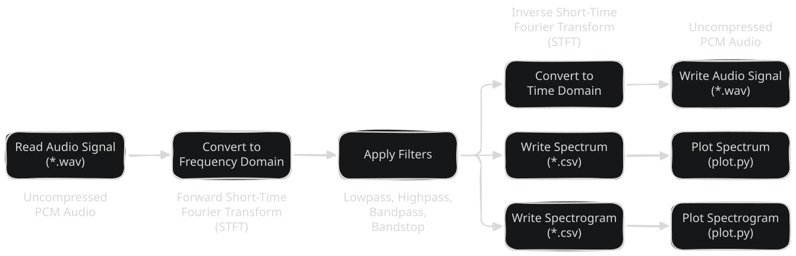

# ESAP <!-- omit in toc -->

A simple, GPU-accelerated pipeline for analyzing and filtering audio signals.

> [!NOTE]
>
> ESAP is short for _Embarrassingly Simple Audio Pipeline_ or _Embarrassingly
> Sequential Audio Pipeline_, whichever you feel is more appropriate. 😄

## Table of Contents <!-- omit in toc -->

* [Introduction](#introduction)
* [Overview](#overview)
* [Usage](#usage)
  * [Prerequisites](#prerequisites)
  * [Building the Pipeline](#building-the-pipeline)
  * [Running the Pipeline](#running-the-pipeline)
  * [Benchmarking the Pipeline](#benchmarking-the-pipeline)
* [License](#license)

## Introduction

This project was inspired by the lectures _Reconfigurable Computing_ and
_Digital Communication Systems_ at the University of Applied Sciences in Wedel.
For the practical part of the Reconfigurable Computing lecture, my classmate and
I brainstormed and ultimately came up with the idea of implementing a simple
pipeline for analyzing and filtering audio signals. The goals of the project can
be summarized as follows:

* **Practical Application**: One of the primary objectives was to apply the
  theoretical knowledge gained from the lectures in a practical setting. This
  allowed us to deepen our understanding of concepts such as the _Discrete
  Fourier Transform_ (DFT), _Fast Fourier Transform_ (FFT), frequency analysis,
  and parallelization.

* **Hardware Acceleration**: By leveraging the power of modern GPUs, we aimed to
  accelerate the analysis and filtering of audio signals. This not only improved
  the performance of our pipeline, but also provided valuable insights into the
  benefits and challenges of hardware acceleration – although we didn't actually
  use any reconfigurable hardware (due to lack of experience). It was especially
  interesting to see how efficiently we could implement the pipeline in software
  (using both a custom variant and FFTW) as well as using two popular GPU APIs
  (CUDA and OpenCL).

## Overview

As previously stated, the main goal of this project was to implement simple
audio analysis and filtering capabilities. The resulting implementation consists
of a multistage pipeline that can be described as follows:



The whole process begins by reading a waveform audio file (WAV) from disk. The
audio signal is then converted to the frequency domain using the DFT, which is
implemented by means of a _Short-Time Fourier Transform_ (STFT). It segments the
audio signal into overlapping frames, applies a window function to reduce
spectral leakage (i.e., unwanted artifacts in the frequency domain), and
computes the DFT for each frame. After that, any number of filters may be
applied to the frequency-domain representation of the audio signal to modify its
characteristics. Currently, the pipeline supports simple lowpass, highpass,
bandpass and bandstop filters.

Following the filtering stage, the (possibly modified) frequency-domain
representation of the audio signal may be converted back to the time domain
using the inverse DFT (or inverse STFT, respectively) and written to disk as a
new waveform audio file. Alternatively, it may be visualized in the form of a
spectrum or spectrogram, which are useful tools for analyzing the frequency
content of audio signals. The pipeline produces these artifacts as CSV files for
reasons of simplicity and compatibility with other tools. However, a Python
script is provided as well to plot the data in a more visually appealing way.

A third and final aspect that shouldn't go unmentioned is the ability to measure
the performance of the pipeline. This feature was implemented to allow for a
quantitative comparison of the different FFT implementations (i.e., CPU vs.
GPU). In particular, both the whole pipeline as well as individual stages may be
benchmarked. The benchmarking process itself is fully automated and
configurable, including the ability to specify the number of warmup and
benchmark iterations, as well as different audio configurations (e.g., duration,
sample rate, number of channels).

The pipeline and its features described above are reflected in the project
structure as follows:

```plaintext
include/
  esap/
    audio-format.hpp  # Type for representing the format of an audio signal
    bench.hpp         # Interface of the benchmarking module
    exceptions.hpp
    export.hpp        # Interface of the export module
    filter.hpp        # Types for representing filters
    func-deleter.hpp
    gpu-context.hpp   # Interface for OpenCL GPU context management
    stft.hpp          # Interface of the STFT module
    types.hpp
    wav.hpp           # Interface of the WAV module
resources/
  pipeline.svg        # Diagram of the pipeline
scripts/
  bench.py            # Script for benchmarking the pipeline
  diagrams.py         # Script for generating diagrams for benchmark results
  plot.py             # Script for plotting a spectrum or spectrogram
  requirements.txt    # External dependencies of the scripts
src/
  bench.cpp           # Implementation of the benchmarking module
  custom-stft.cpp     # Custom implementation of the STFT module
  export.cpp          # Implementation of the export module
  fftw-stft.cpp       # FFTW-based implementation of the STFT module
  gpu-context.cpp     # Implementation for OpenCL GPU context management
  kernels.cl          # OpenCL kernels for the STFT module
  main.cpp            # Main entry point of the pipeline
  opencl-stft.cpp     # OpenCL-based implementation of the STFT module
  wav.cpp             # Implementation of the WAV module
subprojects/          # External dependencies of the pipeline
  ...
.clang-format
.gitignore
LICENSE
meson.build           # Meson build configuration file
meson.options         # Meson build options file
README.md
```

## Usage

The following sections provide instructions on how to build and run the
pipeline, as well as the scripts for benchmarking and plotting.

### Prerequisites

> [!NOTE]
>
> The following instructions assume that you are using a Linux-based operating
> system, although the pipeline should also work on Windows and macOS. Example
> commands are provided for Fedora Linux (since that happens to be the
> distribution I am using), but the general steps should be similar for other
> distributions and operating systems.

The pipeline itself is implemented in C++23 and requires a C++23-compliant
compiler (such as GCC or Clang). Because [Meson](https://mesonbuild.com/) is
used as the build system, it must be installed on your machine as well.

```shell
sudo dnf install meson
```

Besides that, the pipeline depends on the following external dependencies
(depending on which FFT implementation you want to use):

* **[FFTW](https://www.fftw.org/)**: The Fastest Fourier Transform in the West
  (FFTW) is a popular and highly optimized library for computing FFTs in
  software (i.e., on the CPU). It is used as a reference implementation for
  benchmarking the custom FFT implementation and the GPU-based implementations.
  Make sure you have the single-precision floating-point version of the library
  (i.e., `fftw3f`) and its headers installed on your system if you want to build
  the pipeline with support for FFTW.

  ```shell
  sudo dnf install fftw-devel
  ```

* **OpenCL**: OpenCL is a framework for writing programs that execute across
  heterogeneous platforms, including CPUs, GPUs, and other types of specialized
  hardware. It is used to implement the GPU-based FFT implementation of the
  pipeline. The installation of OpenCL is somewhat platform-dependent, so please
  refer to the official documentation of your device vendor (e.g., Intel, AMD,
  NVIDIA) for instructions on how to install the OpenCL drivers. On Linux, a
  nice option is to install the [OpenCL ICD
  Loader](https://github.com/khronosgroup/opencl-icd-loader), which provides a
  generic interface for interacting with OpenCL implementations from different
  vendors.

  ```shell
  sudo dnf install opencl-headers ocl-icd ocl-icd-devel
  ```

* **[VkFFT](https://github.com/DTolm/VkFFT)**: A highly-optimized header-only
  library that provides kernels for computing FFTs on GPUs. It was originally
  designed for Vulkan, but nowadays also supports OpenCL as a backend. It is
  required for the OpenCL implementation of the pipeline and is automatically
  downloaded and built as a subproject by Meson, so you don't have to install it
  manually.

To emphasize once again, you only need to install the dependencies that are
required for the respective FFT implementation you want to use (i.e., FFTW for
the CPU variant and OpenCL for the GPU variant). The pipeline also features a
custom FFT implementation (software-based) that does not have any dependencies
besides the C++ standard library. For more details on that, see [the section on
building the pipeline](#building-the-pipeline).

The benchmarking and plotting scripts are implemented in Python and thus require
a Python interpreter to be installed on your system. It is highly recommended to
create a virtual environment to avoid polluting your system-wide Python
installation with third-party dependencies.

```shell
python -m venv .venv
```

The virtual environment must be activated before installing the dependencies and
running the scripts. This can be done as follows:

```shell
source .venv/bin/activate # Or .venv\Scripts\activate on Windows.
```

To install the required dependencies, run the following command:

```shell
pip install -r scripts/requirements.txt
```

### Building the Pipeline

Once you are sure you have fulfilled the prerequisites for the pipeline, you can
go ahead and build it from source by following these steps:

1. Configure the build process:

   ```shell
   meson setup build
   ```

   By default, this produces an unoptimized debug build of the pipeline with
   FFTW as the backend. Optionally specify `--buildtype=release` to produce an
   optimized release build instead.

   ```shell
   meson setup build --buildtype=release
   ```

   > [!TIP]
   >
   > It may be a good idea to use different build directories for debug and
   > release builds (e.g., by nesting) to avoid conflicts.
   >
   > ```shell
   > meson setup build/debug --buildtype=debug
   > meson setup build/release --buildtype=release
   > ```

   The FFT backend can be selected by specifying the `-Dimpl=<impl>` option,
   where `<impl>` can be `custom` (for the custom CPU implementation), `fftw`
   (for the FFTW implementation) or `opencl` (for the OpenCL implementation).
   The default is `fftw`, as mentioned earlier.

   ```shell
   meson setup build/release --buildtype=release -Dimpl=opencl
   ```

   > [!TIP]
   >
   > Optionally specify the `-Dnative=true` option to enable machine-specific
   > optimizations, which may improve the performance for CPU-related tasks.
   >
   > ```shell
   > meson setup build/release --buildtype=release -Dnative=true
   > ```

2. Build the pipeline:

   ```shell
   meson compile -C build
   ```

### Running the Pipeline

After building the pipeline with the FFT backend of your choice, you can begin
analyzing and filtering audio signals. Run the executable with the `-h` or
`--help` option first to see a description of all available command-line
options:

```shell
./build/esap -h
```

This should produce an output like this:

```plaintext
Usage: esap [OPTION]... FILE
Process the waveform audio file FILE.

Options:
  -b, --benchmark                  Benchmark the execution time (excluding I/O).
      --bench-format={table|json}  Select the format of the benchmark output (default: table).
      --warmups=N                  Perform N warmup iterations before benchmarking (default: 10).
      --iterations=N               Perform N benchmark iterations (default: 100).
      --phase=PHASE                Benchmark only the specified phase of the audio pipeline (default: end-to-end).
                                   PHASE can be one of the following:
                                     end-to-end
                                     forward-only
                                     inverse-only
                                     filter-only
  -f, --filter=SPEC                Apply the specified filter.
                                   SPEC can be one of the following:
                                     lowpass:FREQ
                                     highpass:FREQ
                                     bandpass:FREQ_LOW:FREQ_HIGH
                                     bandstop:FREQ_LOW:FREQ_HIGH
                                   FREQ, FREQ_LOW and FREQ_HIGH are cutoff frequencies in Hz.
                                   Zero or more filters can be specified, which are applied in the given order.
  -o, --output=FILE                Write the processed audio to FILE.
  -s, --spectrum=FILE              Write the spectrum of the processed audio to FILE in CSV format.
  -S, --spectrogram=FILE           Write the spectrogram of the processed audio to FILE in CSV format.
  -h, --help                       Display this help and exit.
  -v, --version                    Display version information and exit.
```

> [!NOTE]
>
> Benchmarking the pipeline is completely optional and can be ignored if you are
> only interested in analyzing and filtering audio signals. For more information
> on benchmarking, see the [next section](#benchmarking-the-pipeline).

Explaining all combinations and interactions of the different command-line
options is beyond the scope of this README, but the following examples should
give you a good idea of how to use the pipeline.

* To produce a spectrum for an audio signal, run the following command:

  ```shell
  ./build/esap -s path/to/spectrum.csv path/to/input.wav
  ```

  The spectrum can afterwards be plotted using the [plotting
  script](scripts/plot.py):

  ```shell
  python scripts/plot.py -s path/to/spectrum.csv
  ```

* To produce a spectrogram for an audio signal, run the following command:

  ```shell
  ./build/esap -S path/to/spectrogram.csv path/to/input.wav
  ```

  The spectrogram can afterwards be plotted using the [plotting
  script](scripts/plot.py):

  ```shell
  python scripts/plot.py -S path/to/spectrogram.csv
  ```

* To apply a bandpass filter to an audio signal and write the processed signal
  to disk, run the following command:

  ```shell
  ./build/esap -f bandpass:300:3400 -o path/to/output.wav path/to/input.wav
  ```

  > [!TIP]
  >
  > You can apply multiple filters in a single command by specifying the `-f`
  > option multiple times. The filters will be applied in the order they are
  > specified. For example, to apply a lowpass filter followed by a highpass
  > filter, run the following command:
  >
  > ```shell
  > ./build/esap -f lowpass:3400 -f highpass:300 path/to/output.wav path/to/input.wav
  > ```

Note that it is possible to combine various command-line options to perform
multiple operations in a single run of the pipeline. For example, to apply a
bandpass filter and produce a spectrum and spectrogram for the processed audio,
run the following command:

```shell
./build/esap -f bandpass:300:3400 -s path/to/spectrum.csv -S path/to/spectrogram.csv -o path/to/output.wav path/to/input.wav
```

> [!IMPORTANT]
>
> The spectrum and spectrogram are always generated after any filters have been
> applied to the audio signal. If you simply wish to analyze the original audio
> signal without modifications, do not specify any filters within the same
> command.

### Benchmarking the Pipeline

The pipeline features a simple built-in benchmarking feature that allows you to
measure the execution time of the pipeline. To take advantage of this feature,
simply specify the `--benchmark` option anywhere in the command:

```shell
./build/esap --benchmark <other options> path/to/input.wav
```

By default, this will benchmark the execution time of the entire pipeline (i.e.,
from start to finish, including the forward and inverse transformations and
application of any filters). However, you may also specify which phase of the
pipeline to benchmark explicitly with the `--phase` option. For example, to
benchmark only the forward transformation, run the following command:

```shell
./build/esap --benchmark --phase=forward-only <other options> path/to/input.wav
```

Other possible options include the number of warmup iterations (`--warmups`,
defaulting to `10`) and the number of benchmark iterations (`--iterations`,
defaulting to `100`). The warmup iterations are performed before the actual
benchmarking to allow the system to reach a steady state and avoid any initial
overheads that may skew the results. The benchmark iterations produce the actual
measurements used to calculate different metrics such as the min, max, mean,
median and standard deviation of the execution time. In any case, the results of
the benchmarking process are printed to `stdout` in a human-readable format,
which may look something like this:

```plaintext
Benchmark (10 warmups, 100 iterations, end-to-end):
┌──────┬─────────────┬─────────────┬─────────────┬─────────────┬─────────────┐
│      │     Min     │     Max     │    Mean     │   Median    │   StdDev    │
├──────┼─────────────┼─────────────┼─────────────┼─────────────┼─────────────┤
│ Wall │    1.828 ms │    3.142 ms │    2.155 ms │    2.160 ms │    0.177 ms │
├──────┼─────────────┼─────────────┼─────────────┼─────────────┼─────────────┤
│ CPU  │    1.825 ms │    3.126 ms │    2.148 ms │    2.153 ms │    0.176 ms │
└──────┴─────────────┴─────────────┴─────────────┴─────────────┴─────────────┘
```

As the built-in benchmarking feature is primarily intended for running a single
benchmark at a time, a separate [benchmarking script](scripts/bench.py) is
provided, which automates the benchmarking process. To execute this script, run
the following command from the root directory of the project:

```shell
python scripts/bench.py
```

By default, this creates a `benchmark` directory in which various artifacts are
stored. This includes a set of generated audio files with different durations,
number of channels and sample rates, as well as the executables for the
different FFT implementations (i.e., custom, FFTW and OpenCL), which are built
automatically. During the benchmarking process, the script runs the pipeline
(using the built-in benchmarking feature described above) for each combination
of audio configuration and FFT implementation, and collects the results in a CSV
file. These can then be analyzed or visualized using other, more specialized
tools.

> [!TIP]
>
> To configure which FFT backends and audio configurations are used during the
> benchmarks, edit the corresponding constants at the top of the [benchmarking
> script](scripts/bench.py) script.

## License

This project is licensed under the MIT License. See the [LICENSE](LICENSE) file
for more information.